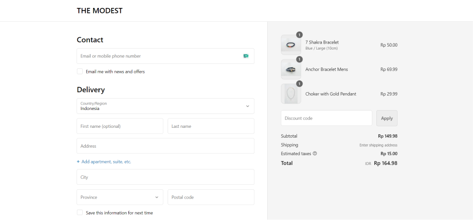

# NEXTJS SHOPIFY INTEGRATION WITH GRAPHQL


This repository contain functional eCommerce that integrate with shopify using Next.js + Tailwind + Graphql. Here we are using Shopify Storefront API to interact with the data. See [Live Demo Here](https://themodest-shopify-nextjs.vercel.app/).

## Screenshot




## Techstack

- Next.js
- Typescript
- GraphQL
- Cypress
- Jest

## On Going Feature Integration

- Get product review from judge.me
- Add discount input before checkout
- Pagination on page products

## How To Run The Project

1. Clone the project
   $ git clone https://github.com/JungRama/shopify-storefront-nextjs.git

2. Get your shopify storefront access token and domain in the admin panel of shopify

3. Setup environtment variable

```
NEXT_PUBLIC_SHOPIFY_STOREFRONT_ACCESSTOKEN=
NEXT_PUBLIC_SHOPIFY_STORE_DOMAIN=
```

4.  running the project
    $ npm run dev

5.  Open the project
    Open http://localhost:3000 with your browser to see the result.
